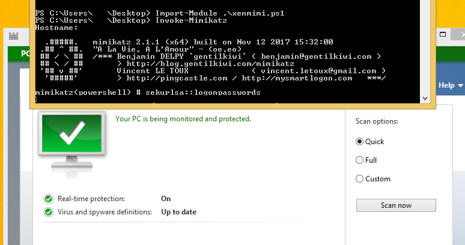

# Xencrypt
### PowerShell crypter v 1.0

## Authors

Xentropy ( [@SamuelAnttila](http://twitter.com/SamuelAnttila) )  
SecForce ( [@SECFORCE_LTD](http://twitter.com/SECFORCE_LTD) )

If you want to read about the design behind this tool and how to make your own crypter, there's an article I wrote about it here: [Write a crypter in any language](https://netsec.expert/2020/02/06/write-a-crypter-in-any-language.html)

## Description

Tired of wasting lots of time obfuscating PowerShell scripts like invoke-mimikatz only to have them get detected anyway?
Wouldn't it be awesome if you could take any script and automatically and with almost no effort generate a near-infinite amount of variants in order to defeat signature-based antivirus detection mechanisms?

WELL, NOW YOU CAN! For the low low price of free! Xencrypt is a PowerShell crypter that uses AES encryption and Gzip/DEFLATE compression to with every invocation generate a completely unique yet functionally equivalent output script given any input script. It does this by compressing and encrypting the input script and storing this data as a payload in a new script which will unencrypt and decompress the payload before running it. In essence, it is to PowerShell what a PE crypter is.

## In action


## Features
Xencrypt:
* Bypasses AMSI and all modern AVs in use on VirusTotal (as of writing)
* Compresses and encrypts powershell scripts
* Has a minimal and often even negative (thanks to the compression) overhead
* Randomizes variable names to further obfuscate the decrypter stub
* Randomizes encryption, compression and even the order that the statements appear in the code for maximum entropy!
* Super easy to modify to create your own crypter variant
* Supports recursive layering (crypter crypting the crypted output), tested up to 500 layers.
* Supports Import-Module as well as standard running as long as the input script also supported it
* Is despite all of the above not a silver bullet for every configuration -- caveat emptor!

## Usage
```
Import-Module ./xencrypt.ps1
Invoke-Xencrypt -InFile invoke-mimikatz.ps1 -OutFile xenmimi.ps1
```
You will now have an encrypted xenmimi.ps1 file in your current working directory. You can use it in the same way as you would the original script, so in this case:
```
Import-Module ./xenmimi.ps1
Invoke-Mimikatz
```

It also supports recursive layering via the -Iterations flag.
```
Invoke-Xencrypt -InFile invoke-mimikatz.ps1 -OutFile xenmimi.ps1 -Iterations 100
```
This will compress and encrypt it 100 times and is useful for dynamic AV bypasses because they have a time-out for analyzing code. There's no fakery here like sleeps that the dynamic scan can skip to get to the end -- it has to go through the entire chain to get to the malicious payload which it usually never does since they normally time out after a second or two or scanning.

Warning though, the files can get big and generating the output file can take a very long time depending on the scripts and number of iterations requested.

## Contributing

If you want to contribute, feel free to contact me on Twitter ( [@SamuelAnttila](http://twitter.com/SamuelAnttila) ) or submit pull requests. Any and all ideas for improvements are welcome and you'll be credited appropriately, just please try to keep it to one file in order to make the tool easy to take with you in your kit.
